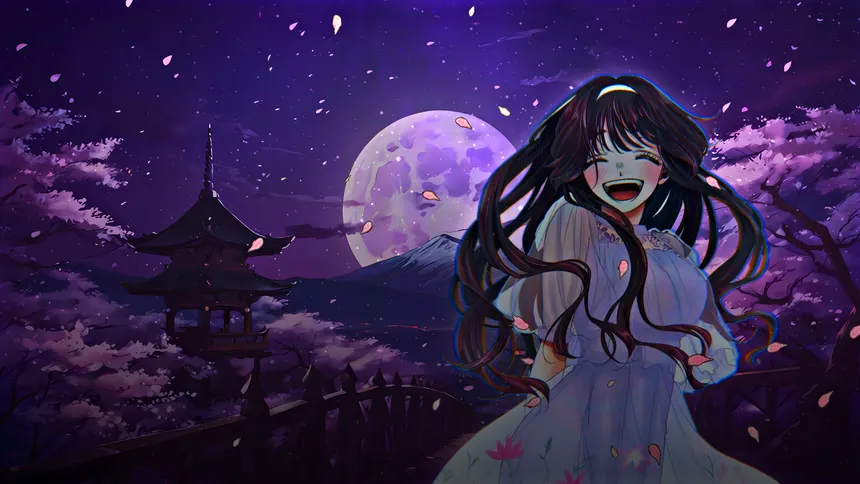

  <!-- BANNER -->
  

    

  <!-- GOTHIC TITLE -->
  <h1>𝔚𝔞𝔤𝔲𝔯𝔦</h1>

  <!-- TELEGRAM BUTTON -->
  

     

  <!-- HERO TYPING ANIMATION -->
  <a href="https://github.com/arikiso/waguri">
    <!-- Main White Header -->
    
     
    <!-- Grey Subtext Feature List -->
    
  </a>

    

